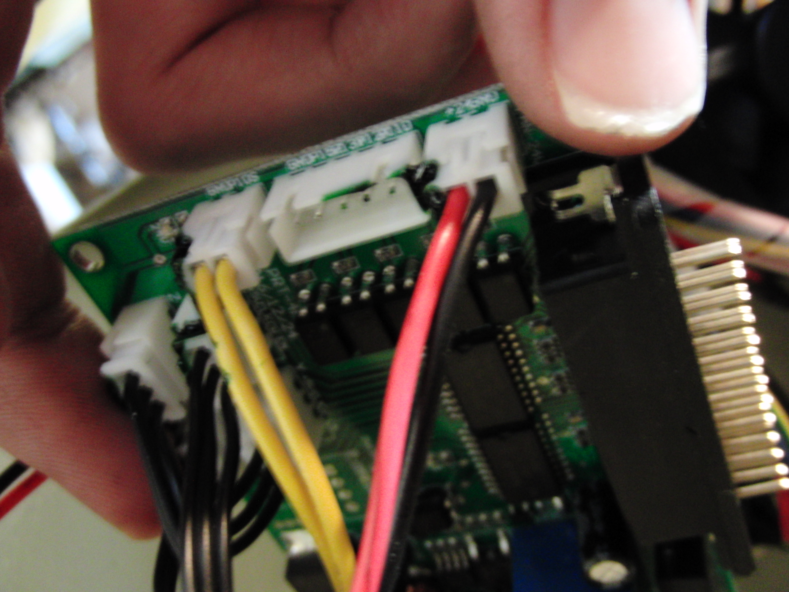
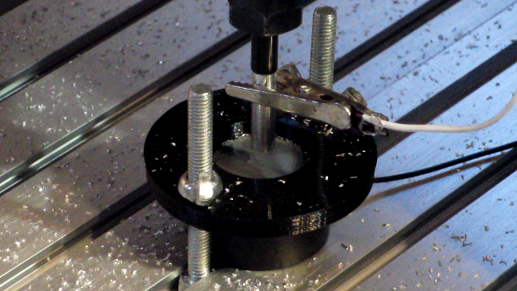

This documents my continuing mission to make 6040 cncs usable.

This contains LinuxCNC configs, python-EMC2 utilities (hole probing, etc.), a threadmill program generator, etc.

It assumes that you have limit switches on all axis, all of which are connected in parallel to one of the inputs. If your CNC doesn't have the input pins broken out, you can buy a 5-position JST-XH 2.5mm plug and connect it to the parallel port breakout:

I spent a while looking for a touch probe system to use on these machines, but I couldn't really find anything that suited my needs. All the homemade stuff generally has concentricity issues etc. 

I found this 1/4" shaft from McMaster that has a 0.002" ceramic coating on it - it's under "Linear Motion Shafts for Harsh Environments", part number 1031K61. If you lathe off 2cm of the coating from one end, and chuck the insulated end in the spindle, you get a totally workable touch probe:

I've gotten repeatability values of around 0.05mm with this setup. 

I also recommend you get a cheap tool touch plate from eBay - they're like $5. I wired the touch plate and an alligator clip for the probe to the LinuxCNC probe input - just make sure you ground the probe itself if you're touching off:

I'm using a rather convoluted method for tool height adjustment, though it does function.

